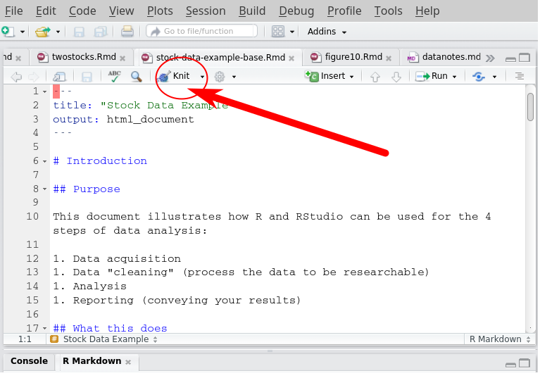

--- 
title: "Setting up R and Friends"
author: "Professor Robert McDonald"
date: "`r format(Sys.Date(), format='%B %d, %Y')`"
output:
  bookdown::html_document2:
    highlight: default
    theme: spacelab
    toc: yes
    toc_float:
      collapsed: no
      smooth_scroll: yes
  bookdown::pdf_document2:
    keep_tex: yes
    number_sections: yes
fontsize: 12pt
colorlinks: yes
urlcolor: red
---

```{r, echo=FALSE}
library(knitr)
pkglink = function(pkg) paste('[', pkg, '](http://cran.r-project.org/web/packages/', pkg,'/index.html)', sep='')
opts_chunk$set(echo=FALSE,
               message=FALSE,
               cache=TRUE

               )
```

# License   {width=12%}

This document is licensed under the [Creative Commons Attribution-NonCommercial 4.0 International License](http://creativecommons.org/licenses/by-nc/4.0/) 


<!--
<a rel="license" href="http://creativecommons.org/licenses/by-nc/4.0/"></a><br /><span xmlns:dct="http://purl.org/dc/terms/" property="dct:title">Setting up R and friends</span> by <a xmlns:cc="http://creativecommons.org/ns#" href="https://github.com/rmcd1024/software-setup" property="cc:attributionName" rel="cc:attributionURL">Robert McDonald</a> is licensed under a <a rel="license" href="http://creativecommons.org/licenses/by-nc/4.0/">Creative Commons Attribution-NonCommercial 4.0 International License</a>.

-->

# Overview  

These are instructions for setting up R and RStudio.

It is critical that you have a working R installation *before* the
first class. Please follow the directions below, as soon as
possible. You will

* install R and RStudio
* download and run [the sample
program](http://derivatives.kellogg.northwestern.edu/rclass/rcode/stock-data-example-base.Rmd)
to test your installation.  Running this file will take some time
because it is doing two things: It will install additional packages,
and it will download stock price data and create plots and regressions
using the data.
* install \LaTeX\ following instructions below. (You need to do this *after*
 you run the sample program, which will install the tinytex package.)

Because all of this might take some time, *please do it well in
advance*. If you need help, you may contact KIS at 847-467-2100
(Global Hub) or 312-503-0159 (Weiboldt) or by email at
kis@kellogg.northwestern.edu. They have tested these instructions and
should be able to help if you encounter problems.


# Detailed instructions

You will first install R, RStudio, and \LaTeX. You will then use
RStudio to run an example program (linked below). Running this program
will verify that your installation is working. It will also install
additional packages that we will use in the course.
	
If you already have the programs installed, please visit the software
web pages to make sure that your versions are up date.


## Install R {.tabset} 


### R is not installed

R installers for Windows, OS X, and Linux are at
[https://mirror.las.iastate.edu/CRAN/](https://mirror.las.iastate.edu/CRAN/).
<!--For Linux, run `sudo apt install r-base` (Debian or Ubuntu) or
`sudo yum install R-core` (Redhat or Fedora) --> Download and run the
installer for your operating system. If the installer asks questions,
accept the defaults unless you have a reason for doing otherwise. The
current versions of R require OS X 10.11 or higher.^[If you are using
an older version of OS X, you probably know that Apple has stopped
issuing security patches for OS X 10.10 and earlier. If you are
sticking with your unsupported OS, follow the directions at the
installer page to install either R 3.3.3 (10.9 or higher) or R 3.2.1
(10.6-10.8). This will probably (but no guarantees) be sufficient for
your needs at Kellogg.  However, if you are running a version of OS X
older than 10.11, you are at risk and you really
should update the OS.]  

### R is already installed

If you already have R installed, you can check the version by running
`R.Version()$version.string` at the command line. Most likely, any
version later than 3.0 will be fine. The latest version (as of August
2018) is 3.5.1. If you update from a version earlier than 3.5.0, you
will have to reinstall all of your packages from scratch.

##  Install RStudio

RStudio installers for Windows, OS X, and Linux are at
[http://rstudio.com/](https://www.rstudio.com/products/rstudio/download/#download). Download
and run the installer for your operating system. If you already have
RStudio installed, please be sure to update it to version 1.1.456 or
later.

Note that RStudio is not the same thing as R! RStudio provides
convenient access to R, and adds components such as
[pandoc](http://pandoc.org/). *You need to install both R and RStudio.*

## Install LaTeX {.tabset}


LaTeX is a suite of programs that collectively produce pdf documents;
there is no individual application called "LaTeX".  You will never
have to run any of these programs yourself. Rather, RStudio uses
LaTeX, behind the scenes, as needed. 

### You already have LaTeX

If you already have LaTeX installed, you don't need to do anything
  else in this section.

### You do not have LaTeX

If you do *not* have LaTeX installed (if you aren't sure, you
  probably don't) then you can install a minimal version of LaTeX by
  running this command at the console in RStudio:
  
  ```{r, eval=FALSE, echo=TRUE}
  tinytex::install_tinytex()
  ```


For general information about LaTeX see
the [the LaTeX project page](https://www.latex-project.org/).
  

## Run the sample program


1. Save
[stock-data-example-base.Rmd](http://derivatives.kellogg.northwestern.edu/rclass/rcode/stock-data-example-base.Rmd)
to your computer. You should use a directory where you will
save documents associated with this class. Running the program will
create output files (both data and HTML files), so you should pick an
appropriate location. *Be sure to save the file using the extension
".Rmd"; your browser or operating system may try to append ".txt", and
this will potentially cause problems. If this happens, just delete the
appended ".txt" before or after saving.*

2. Run RStudio and use the File|Open menu to load
   stock-data-example-base.Rmd. (Make sure that it is saved with a
   .Rmd extension.)

3. After loading the file, click the "knit" button (see Figure 
\@ref(fig:knitbutton)).  RStudio will likely ask your permission to
install necessary packages. Allow it to do so. When it finishes
installing packages, you may need to click the "knit" button a second
time.

```{r knitbutton, echo=FALSE, out.width='85%', fig.cap='Knit button in RStudio'}

```


4. The document you produce should include figures that look like
Figure \@ref(fig:plotsgg), along with some additional tables.

5. Take a look at the output (and possibly the code --- don't worry if
    you don't understand any of it) and think about these questions:
    
	a. How would you have done this exercise in Excel, i.e. what would
    be involved in downloading stock price data, computing returns,
    constructing four plots, and creating an html version of your
    exercise? 
	
	a. What would be required to do this exercise for 1000
    stocks? (Please don't attempt this -- someone is providing server
    capacity; let's not abuse it!) 
	
	a. How would you create a Word document (docx file) reporting
    these results?
    


```{r getdata, echo=FALSE, message=FALSE, eval=TRUE, warning=FALSE}
ticker = 'F'
tickername = 'Ford'
filename = 'fordstockdata.csv'
library(tidyverse)
library(gridExtra)
library(tidyquant)
if (file.exists(filename)) {
  s = read_csv(filename)
} else {
  s <- tq_get(ticker, from='2010-01-01', to='2016-12-31')
}
##s$Date <- as.Date(s$Date)
s <- s %>% arrange(date) %>%
    mutate(ret=log(adjusted)-lag(log(adjusted)),
           year=year(date),
           dow=weekdays(date))
```


```{r plotsgg, echo=FALSE, eval=TRUE, out.width='90%', message=FALSE, warning=FALSE, fig.cap="Various views of Ford's stock price return"}
plot1 = ggplot(s, aes(x=date, y=adjusted/adjusted[1])) + 
  geom_line() + 
  labs(x='date', y='Cumulative Return (log scale)') + 
  scale_y_log10(breaks=c(0.5, 1, 1.5, 2)) +
  ggtitle(paste0(tickername, ' Cumulative Return (log scale)'))  
## plot the daily return
plot2 = ggplot(s, aes(x=date, y=ret)) + geom_line() + 
  labs(x='Date', y='Daily Return') +
  ggtitle(paste0(tickername, ' Daily Return'))
## plot the squared stock return
plot3 = ggplot(s, aes(x=date, y=ret^2)) + geom_line() + 
  labs(x='Date', y='Squared Daily Return') +
  ggtitle(paste0(tickername, ' Squared Return'))
minret <- min(s$ret, na.rm=TRUE)
maxret <- max(s$ret, na.rm=TRUE)
## plot a histogram of returns
plot4 = ggplot(s, aes(ret)) + geom_histogram(bins=50) +
  labs(x='Daily Return') + 
  ggtitle(paste(tickername, "Daily Returns")) + 
  geom_vline(xintercept=c(minret, maxret), linetype=3, col=c('red', 'green'))
theme_set(theme_bw())
grid.arrange(plot1, plot2, plot3, plot4, ncol=2)
```

<!--  
# Readings

The following 

* Hadley Wickham on [data cleaning](http://vita.had.co.nz/papers/tidy-data.pdf) 
* [R for Data Science](http://r4ds.had.co.nz/). This is the free web version of an excellent book.
* Take a look at these Shiny apps, constructed using R and the shiny package
      * [Binomial option pricing](https://rmcd1024.shinyapps.io/binomplot/) 
      * [Babynames lookup](https://rmcd1024.shinyapps.io/babynames_shiny/)
      
* A [tutorial I have written](http://kellogg.northwestern.edu/faculty/mcdonald/ftp/Rtutorial.pdf). The approach here is different than what I will do in class. If you are interested, you can read chapters 1 and 2, and at least skim Chapter 6.
* An article about [Microsoft building R into its products](http://www.infoworld.com/article/3156544/big-data/microsofts-r-tools-bring-data-science-to-the-masses.html)

-------

Last edited: `r format(Sys.time(), "%B %d, %Y at %r")`. This page was created in [RStudio](https://www.rstudio.com/) using [Rmarkdown](http://rmarkdown.rstudio.com/).

Comments and feedback to 
[Robert McDonald](mailto:r-mcdonald@northwestern.edu). Thanks!

-->
